# TasteByte-2025

## Link a videos de Entrega Final: https://drive.google.com/drive/folders/1TLMYm36QIbzLLQiP3_gKo0uLmYCgJUAc?usp=drive_link
## Link a Imágenes: https://drive.google.com/drive/folders/1QiK3PKqOfU14Znb2zRlVsp1zSXOQFefV?usp=sharing

## Integrantes ✒️ 
* Panuccio Francisco
* Roman Tomas
* Avallone Joaquin

## Correcciones Neiner - Clase 08 (24/10/25)
Imagen 1 (principal - mozo):
Si el círculo que está en el medio de la pantalla es una foto del empleado, hacerla más grande. 
Si 'Pedidos' es la única opción, quitar esa pantalla y redirigir directamente a la opción en cuestión.
Evitar textos en botones (recordar que los empleados están en constatnte movimiento y poca luz, deberían poder acceder a las opciones con un golpe de vista. Reemplazarlo por íconos, imágenes alusivas, etc (grandes).

Imagen 2 (principal - cocina):
Ídem anterior.

Imagen 3 (principal - bar):
Ídem anterior.

Imagen 4 (alta - plato):
Agrandar el tamño para las fotos.
El mensaje que indica que faltan 3 foto(s) tiene un par de problemas. Primero, sacar la 's' de entre los paréntesis, son 3 fotos. Segundo, ¿fondo verde oscuro y letras de color rojo? El contraste es pésimo. Luego del botón tomar fotos, sale cortado...

Imagen 5 (registro empleado):
Texto en campo DNI sale cortado. El botón para escanear el código es pequeño.
Quitar el botón de Iniciar sesión, es una pantalla para generar un registro.

Imagen 6 (¿carrito de compras?):
Dejar más espacio para las descripciones, pueden se más extensas.

Imagen 7 (?):
Tiene mucho espacio libre y además no sé que es ¿botón sii? y otro botón abrir chat

Imagen 8 (push - mesa asignada):
Está bien.

Imagen 9 (ingreso anónimo):
Está bien.

Imagen 10 (lista de espera):
Quitar el estado, que siempre será pendiente si está en el listado. Aprovechar ese 'renglón' extra para agrandar un poco más la foto.

Imagen 11 (correo rechazo):
Falta el logo de la empresa. En cuanto al mensaje, quitar la parte que dice: "En unos minutos un dueño o supervisor autorizará su ingreso" ya que pueden pasar más que unos minutos y también puede pasar que no lo autoricen.

Imagen 12 (pedidos mozo - aceptados):De nuevo, es un empleado que está en constante movimiento y, seguramente, mire el dispositivo mientres camine. Es un arco íris esta pantalla. De un golpe de vista no se lleva nada.
Luego, quitar esos botones o solapas con los listados, generar botones flotantes, opciones de menú, o algo para que solo vea una sección a la vez, y de ser necesario, ingrese a la siguiente. ¿Impagados?
El número de mesa, bien grande. El estado, acá tampoco va. Si estoy en el listado de 'Aceptados', el estado siempre será 'Aceptado'. El tiempo de espera es irrelevante para el mozo, pero si lo quieren dejar, quitar todas las abreviaturas. El total no interesa (hasta que se quiera abonar), quitar.
Con toodo el espacio ganado, indicar, mediante gráficos, imágenes, íconos, etc. el estado del pedido en cada sector (cocina y bar)

Imagen 13 (pedidos mozo - pendientes):Ídem anterior, no tener esos botones superioes. No hay listados para evaluar.

Imagen 14 (iniciar sesión):Igualar en tamaño a los botones de la parte inferior 'Crear cuenta' y el de 'Ingreso anónimo'

NOTA: muchos enlaces a las imágenes no cargan. Dichas imágenes no fueron evaluadas.
Dejar las imágenes en una carpeta compartida, así se pueden ver todas

## Responsabilidades (Primera Semana) 🛠️
* Panuccio
- Objetivos: Integración Completa con BD, Servicios Generales para las Altas, Item 2 (Alta Plato) y 4 (Alta Mesa)
- Fecha Inicial: 06/09/2025
- Fecha Final: 08/09/2025 (Todas las Tareas Finalizadas)
- Branch: panuccio/altas

  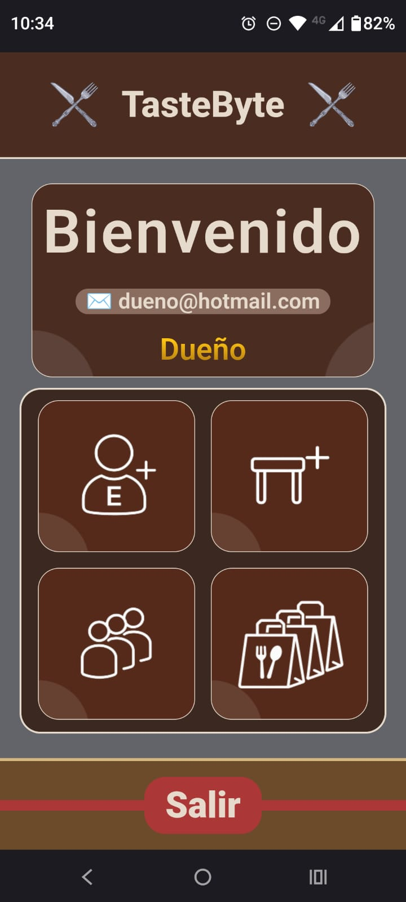
  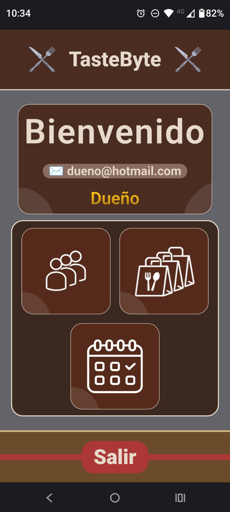
  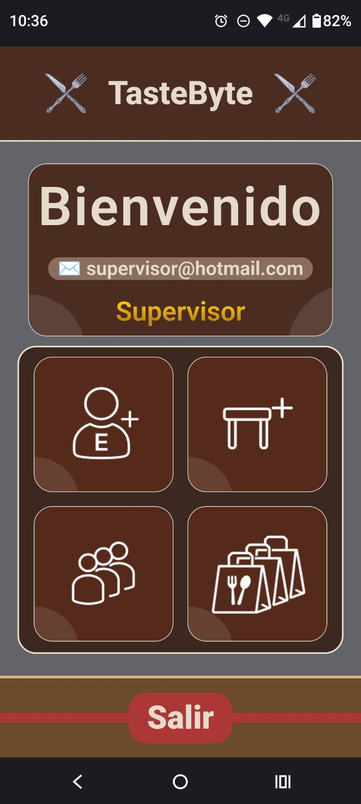
  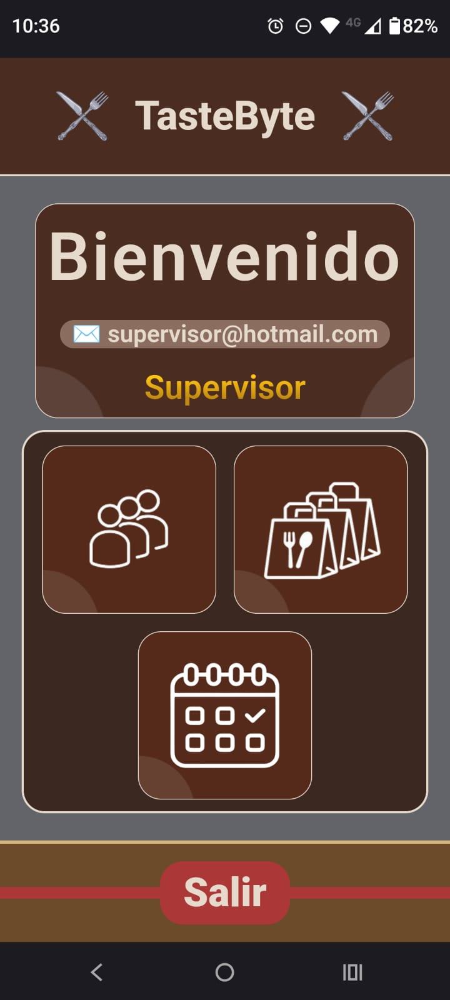
  
  
  
  
  
  
  
  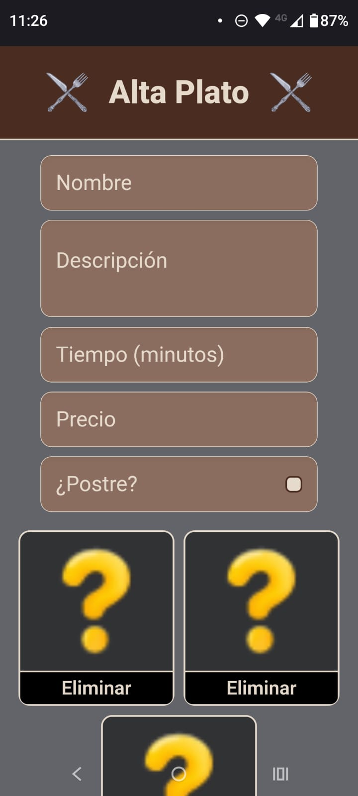
  
  

* Roman
- Objetivos: Splash Screen, Login y Registro, Punto 1 (Alta Empleado)
- Fecha Inicial: 06/09/2025
- Fecha Final: 12/09/2025 (Todas las Tareas Finalizadas)
- Branch: roman

  
  
  
  
  
  
  
  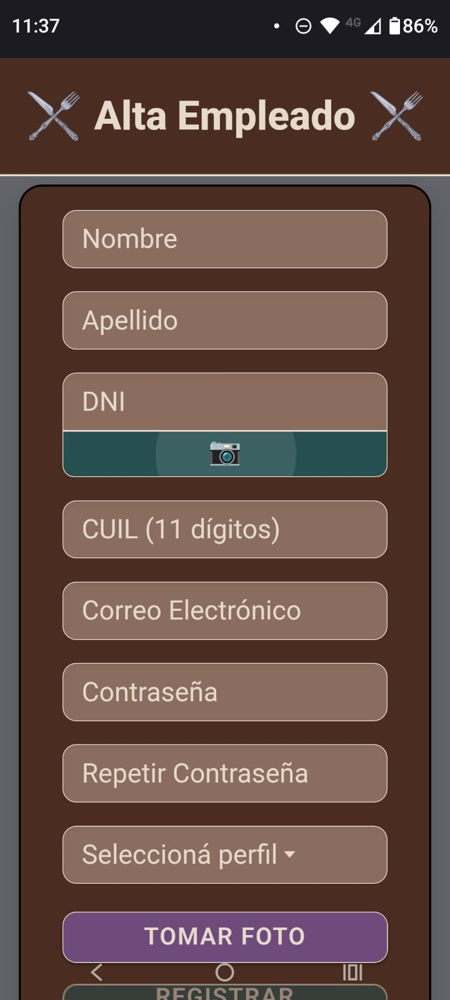
  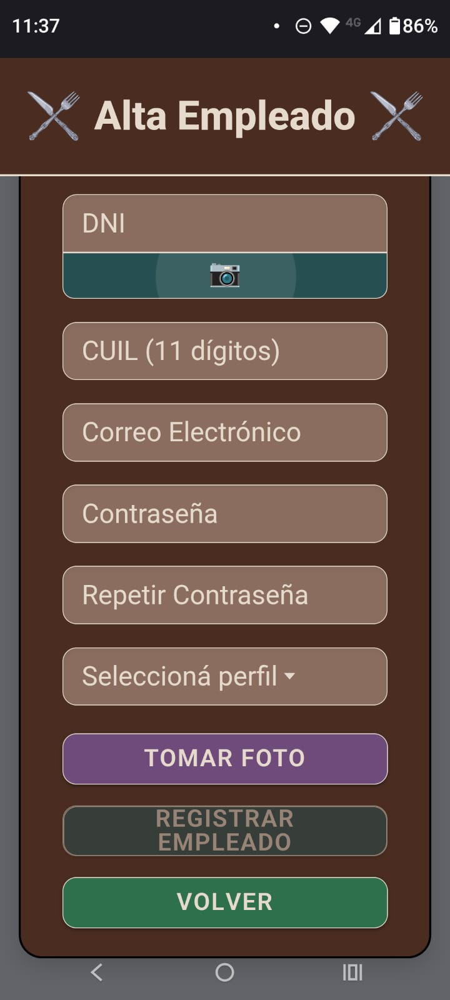

* Avallone
- Objetivos: Puntos 3 (Alta Bebida), 5 (Alta Cliente) y 6 (Verificación de Ingreso de Cliente Registrado)
- Fecha Inicial: 06/09/2025
- Fecha Final: 12/09/2025 (Todas las Tareas Finalizadas)
- Branch: avallone

  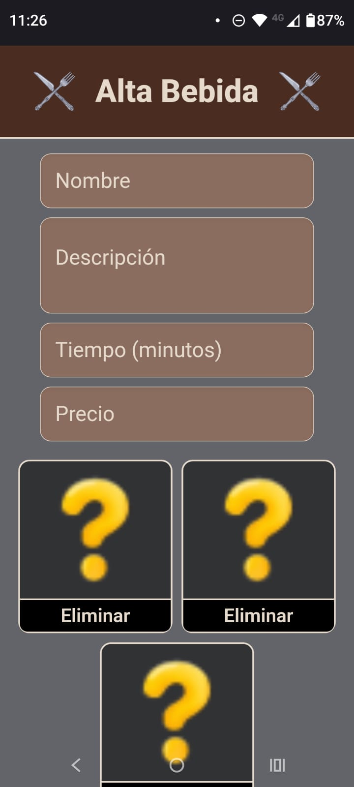
  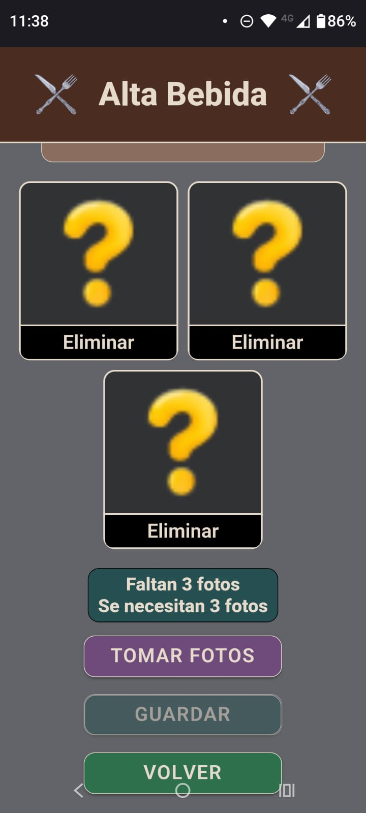
  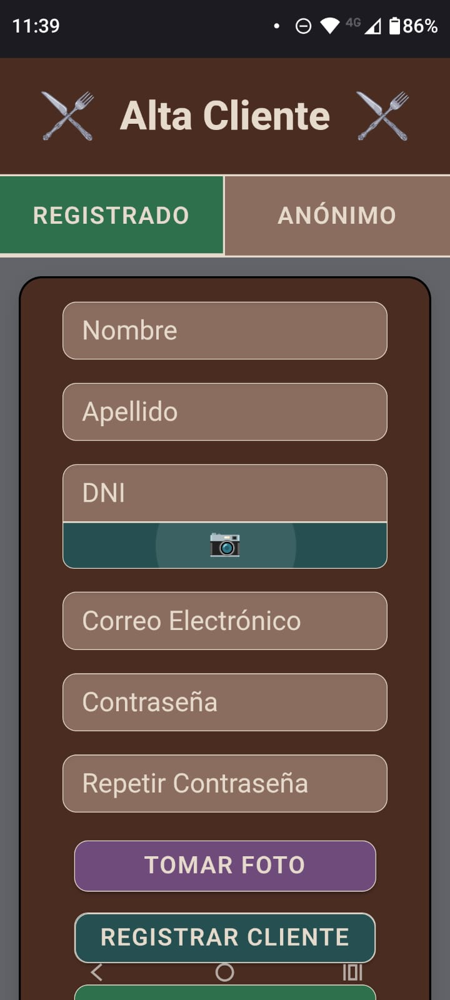
  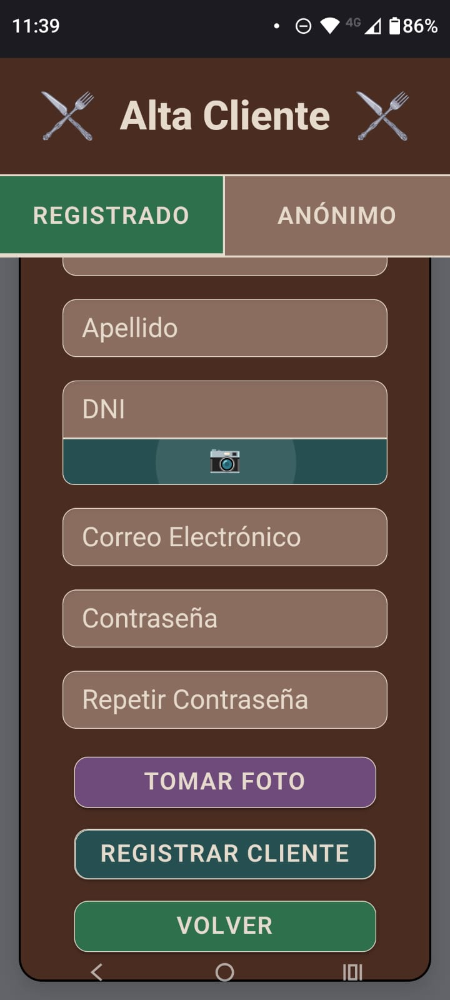
  

## Responsabilidades (Segunda Semana) 🛠️
* Panuccio
- Objetivos: Puntos 11 (Listado de Productos para el Pedido) y 12 (Realización del Pedido) e Integración Completa del Envío de las Notificaciones
- Fecha Inicial: 15/09/2025
- Fecha Final: 19/09/2025 (Todas las Tareas Finalizadas)
- Branch: panuccio/altas

  
  
  
  
  
  
  
  
  
  
  

* Roman
- Objetivos: Puntos 9 (Ingreso de Cliente Anónimo), 10 e Integración Completa de QR
- Fecha Inicial: 15/09/2025
- Fecha Final: 19/09/2025 (Todas las Tareas Finalizadas)
- Branch: roman

  
  
  
  
  

* Avallone
- Objetivos: Puntos 7 (Rechazo de Ingreso de Cliente Registrado), 8 (Aceptación de Ingreso de Cliente Registrado) e Integración Completa del Envío del Email
- Fecha Inicial: 15/09/2025
- Fecha Final: 19/09/2025(Todas las Tareas Finalizadas)
- Branch: avallone

  
  
  
  

## Responsabilidades (Tercera Semana) 🛠️
* Panuccio
- Objetivos: Puntos 13 (Rechazo de Pedido), 14 (Aceptación de Pedido) y 20 (Encuesta al Cliente)
- Fecha Inicial: 22/09/2025
- Fecha Final: 24/09/2025
- Branch: panuccio/altas

  
  
  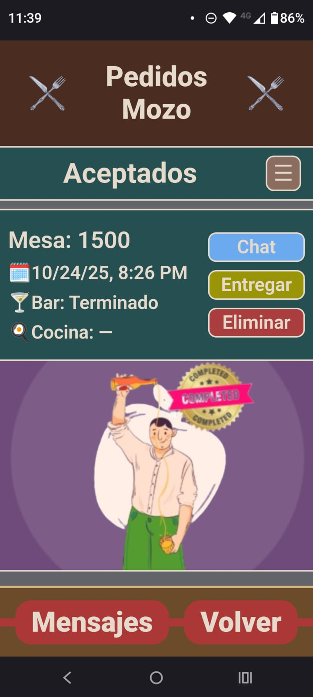
  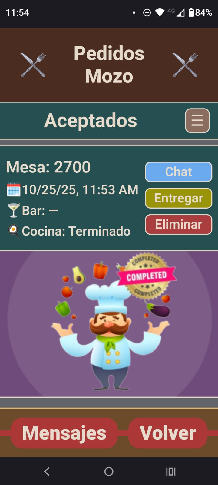
  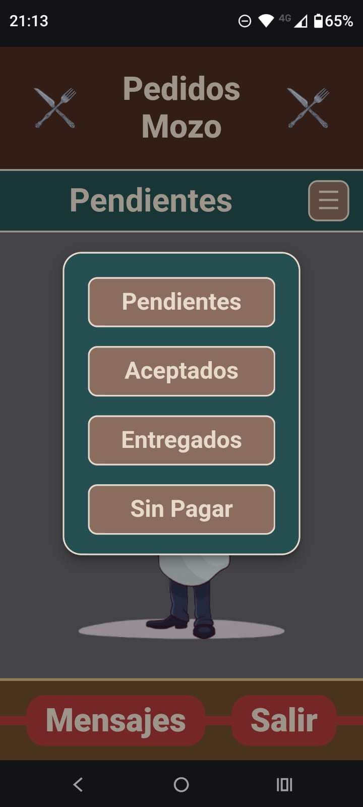
  
  
  
  
  
  

* Roman
- Objetivos: Puntos 15 (Acceso a Juegos), 19 (Entrega del Pedido)
- Fecha Inicial: 22/09/2025
- Fecha Final: 25/09/2025
- Branch: roman

  
  
  
  

* Avallone
- Objetivos: Puntos 16 (Cocina Recibe Productos)
- Fecha Inicial: 22/09/2025
- Fecha Final: 
- Branch: avallone

  
  

## Responsabilidades (Cuarta Semana) 🛠️
* Panuccio
- Objetivos: Estilado de Encuestas y Corrección de Push Notifications, 18 (Pedido Completado)
- Fecha Inicial: 29/09/2025
- Fecha Final: 3/10/2025
- Branch: panuccio/altas

* Roman
- Objetivos: 21 (Solicitud de Cuenta), Punto 22 (Confirmación de Pago y Liberación de Mesa)
- Fecha Inicial: 29/09/2025
- Fecha Final: 3/10/2025
- Branch: roman

  
  

* Avallone
- Objetivos: 17 (Bar Recibe Productos)
- Fecha Inicial: 29/09/2025
- Fecha Final: 3/10/2025
- Branch: avallone

  
  

## Responsabilidades (Quinta Semana) 🛠️
* Panuccio
- Objetivos: Punto 31 (Acelerómetro y Giroscopio), Punto Recuperatorio - Email con Factura (Cliente Registrado)
- Fecha Inicial: 20/10/2025
- Fecha Final: 24/10/2025
- Branch: panuccio/altas

  
  

* Roman
- Objetivos: Punto Recuperatorio - Push Notification con Factura (Cliente Anónimo)
- Fecha Inicial: 20/10/2025
- Fecha Final: 24/10/2025
- Branch: roman

* Avallone
- Objetivos: Punto 23 (Login con Google)
- Fecha Inicial: 20/10/2025
- Fecha Final: 24/10/2025
- Branch: avallone

## Responsabilidades (Sexta Semana) 🛠️
* Panuccio
- Objetivos: Puntos 27 - 28 - 29 - 30
- Fecha Inicial: 24/10/2025
- Fecha Final: 28/10/2025
- Branch: panuccio/altas

  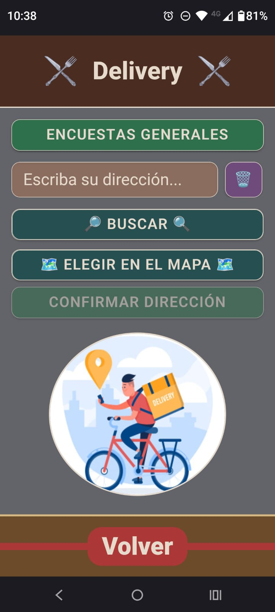
  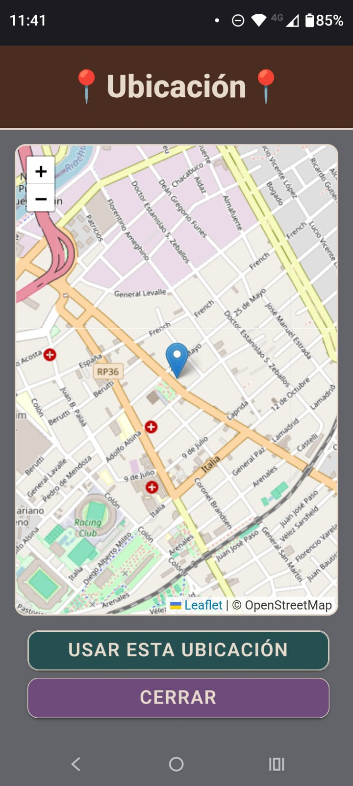
  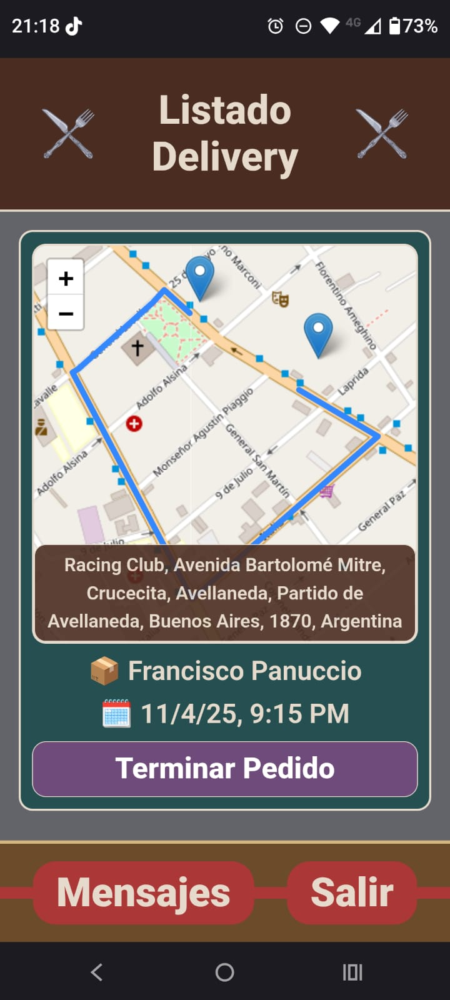
  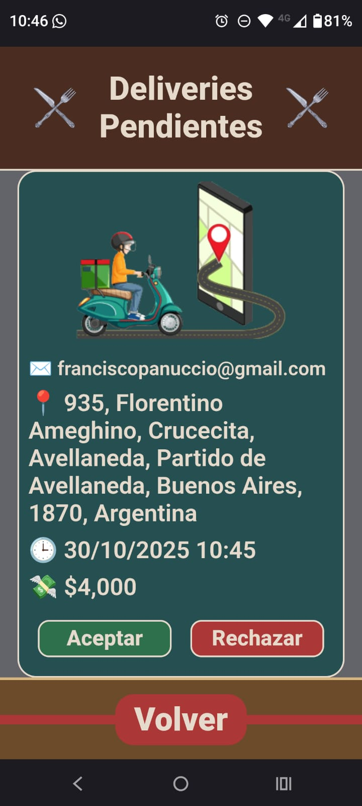
  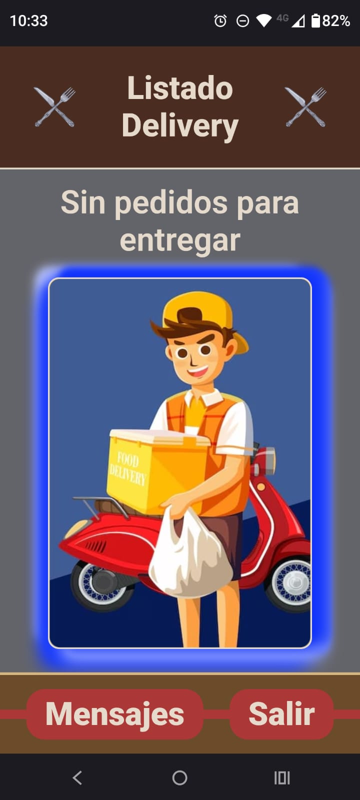
  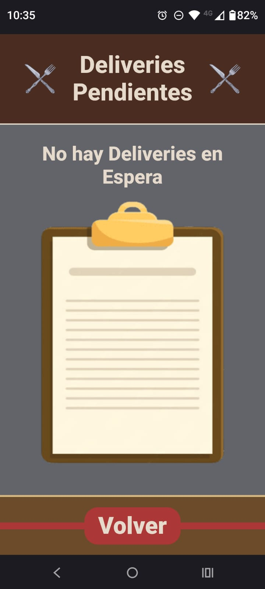

* Roman
- Objetivos: Puntos 24 - 25 - 26
- Fecha Inicial: 25/10/2025
- Fecha Final: 28/10/2025
- Branch: roman

  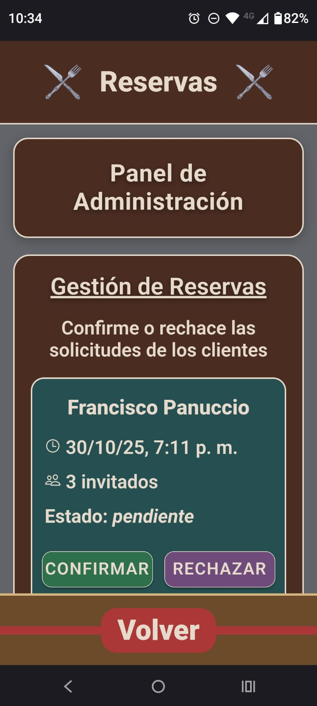
  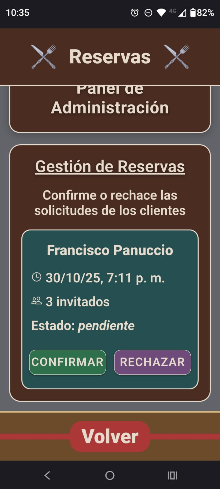
  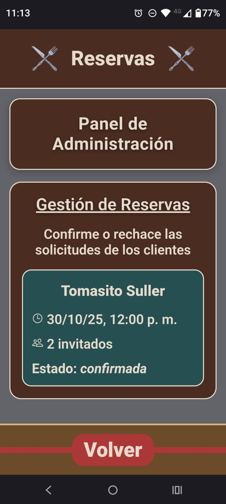
  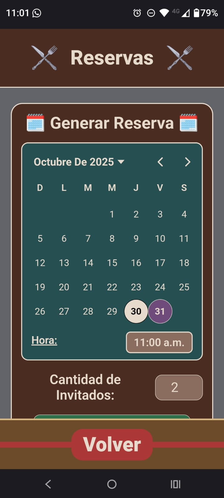
  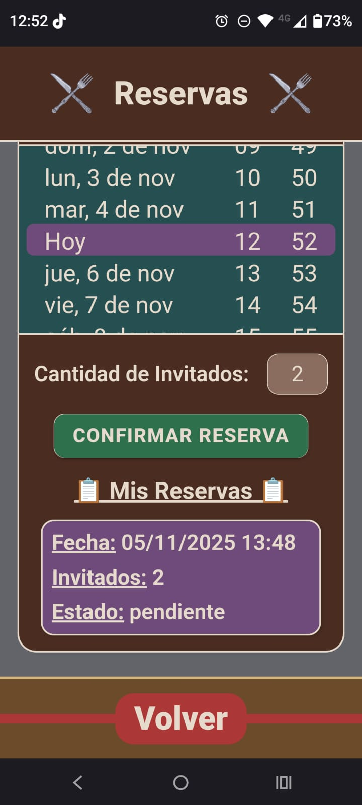
  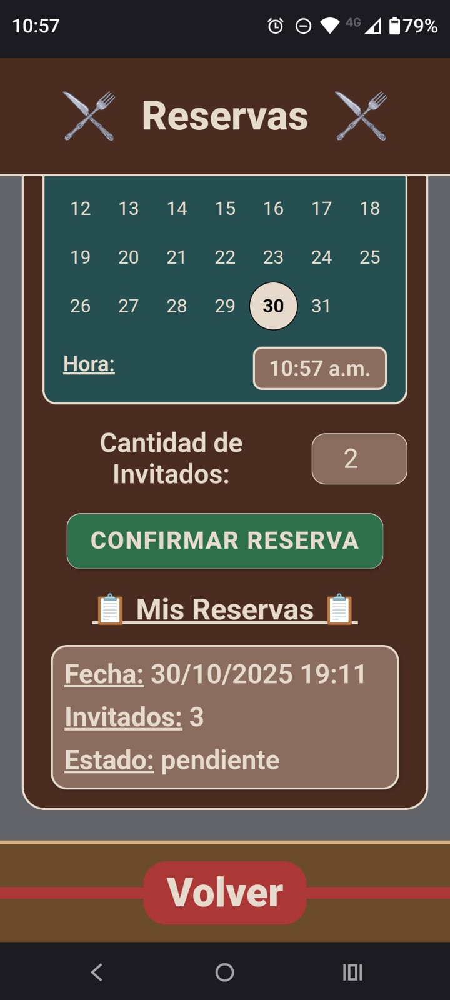
  
  

