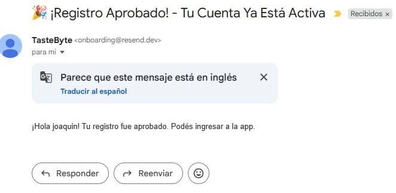
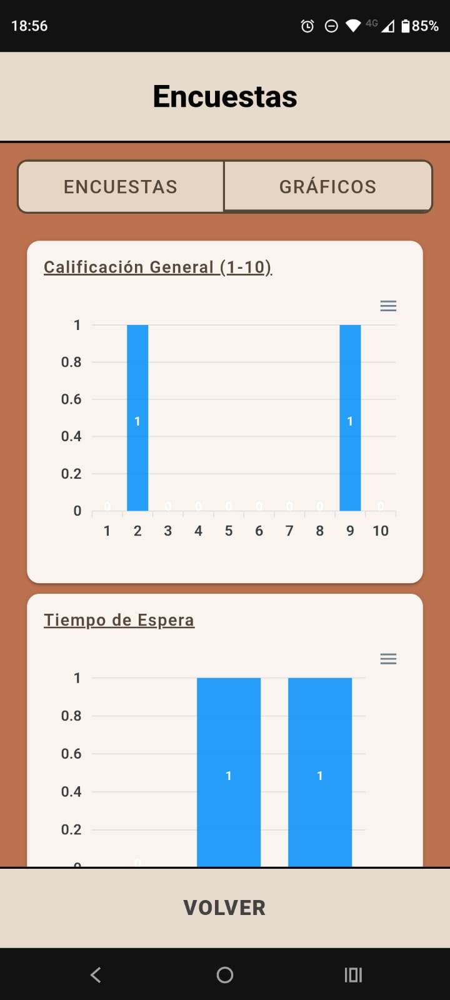
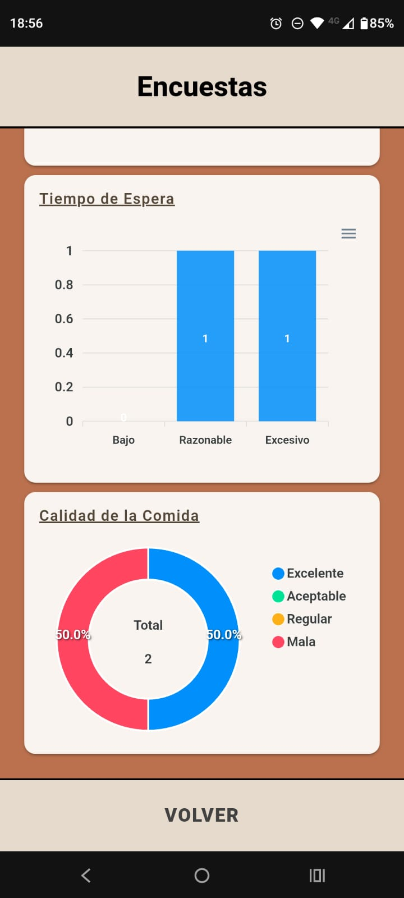
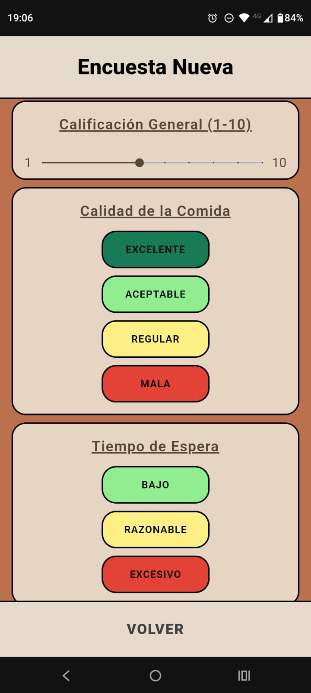
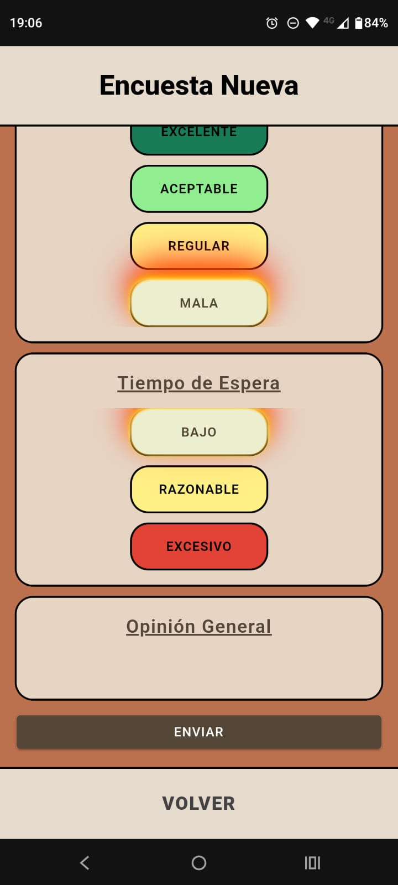
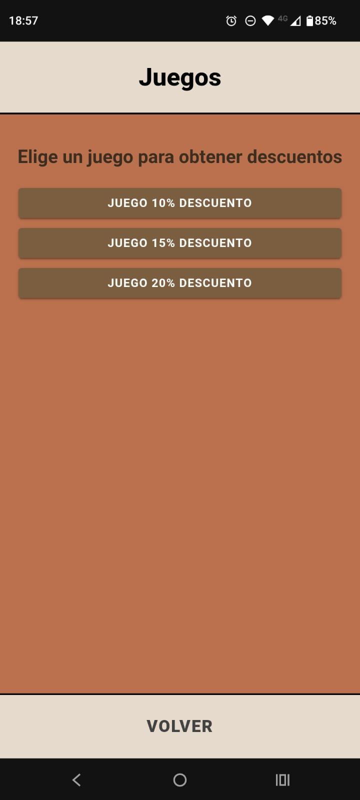
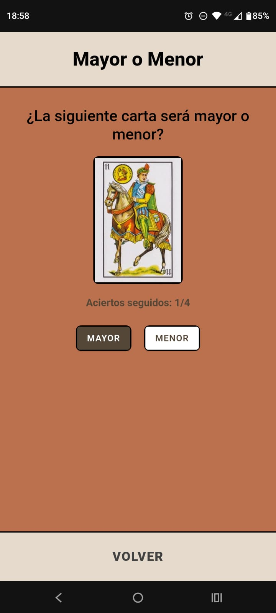
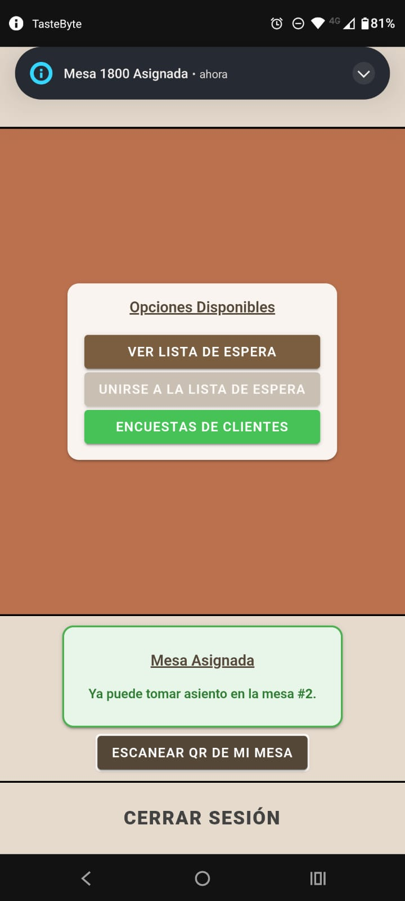
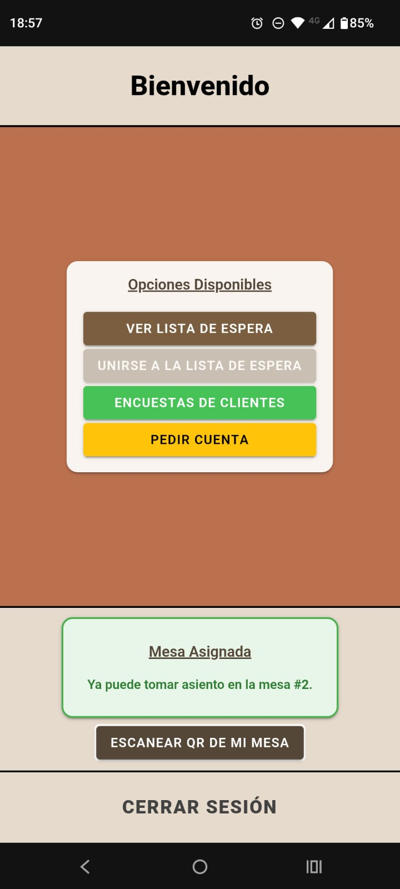

# TasteByte-2025

## Integrantes ✒️ 
* Panuccio Francisco
* Roman Tomas
* Avallone Joaquin

## Responsabilidades (Primera Semana) 🛠️
* Panuccio
- Objetivos: Integración Completa con BD, Servicios Generales para las Altas, Item 2 (Alta Plato) y 4 (Alta Mesa)
- Fecha Inicial: 06/09/2025
- Fecha Final: 08/09/2025 (Todas las Tareas Finalizadas)
- Branch: panuccio/altas

  
  
  
  
  
  
  
  

* Roman
- Objetivos: Splash Screen, Login y Registro, Punto 1 (Alta Empleado)
- Fecha Inicial: 06/09/2025
- Fecha Final: 12/09/2025 (Todas las Tareas Finalizadas)
- Branch: roman

  
  
  
  
  

* Avallone
- Objetivos: Puntos 3 (Alta Bebida), 5 (Alta Cliente) y 6 (Verificación de Ingreso de Cliente Registrado)
- Fecha Inicial: 06/09/2025
- Fecha Final: 12/09/2025 (Todas las Tareas Finalizadas)
- Branch: avallone

  
  
  

## Responsabilidades (Segunda Semana) 🛠️
* Panuccio
- Objetivos: Puntos 11 (Listado de Productos para el Pedido) y 12 (Realización del Pedido) e Integración Completa del Envío de las Notificaciones
- Fecha Inicial: 15/09/2025
- Fecha Final: 19/09/2025 (Todas las Tareas Finalizadas)
- Branch: panuccio/altas

  
  
  
  
  

* Roman
- Objetivos: Puntos 9 (Ingreso de Cliente Anónimo), 10 e Integración Completa de QR
- Fecha Inicial: 15/09/2025
- Fecha Final: 19/09/2025 (Todas las Tareas Finalizadas)
- Branch: roman

  
  

* Avallone
- Objetivos: Puntos 7 (Rechazo de Ingreso de Cliente Registrado), 8 (Aceptación de Ingreso de Cliente Registrado) e Integración Completa del Envío del Email
- Fecha Inicial: 15/09/2025
- Fecha Final: 19/09/2025(Todas las Tareas Finalizadas)
- Branch: avallone

  
  

## Responsabilidades (Tercera Semana) 🛠️
* Panuccio
- Objetivos: Puntos 13 (Rechazo de Pedido), 14 (Aceptación de Pedido) y 20 (Encuesta al Cliente)
- Fecha Inicial: 22/09/2025
- Fecha Final: 24/09/2025
- Branch: panuccio/altas

  
  
  
  
  

* Roman
- Objetivos: Puntos 15 (Acceso a Juegos), 19 (Entrega del Pedido)
- Fecha Inicial: 22/09/2025
- Fecha Final: 25/09/2025
- Branch: roman

  
  
  
  

* Avallone
- Objetivos: Puntos 16 (Cocina Recibe Productos)
- Fecha Inicial: 22/09/2025
- Fecha Final: 
- Branch: avallone

  

## Responsabilidades (Cuarta Semana) 🛠️
* Panuccio
- Objetivos: Estilado de Encuestas y Corrección de Push Notifications, 18 (Pedido Completado)
- Fecha Inicial: 29/09/2025
- Fecha Final: 3/10/2025
- Branch: panuccio/altas

  

* Roman
- Objetivos: 21 (Solicitud de Cuenta), Punto 22 (Confirmación de Pago y Liberación de Mesa)
- Fecha Inicial: 29/09/2025
- Fecha Final: 3/10/2025
- Branch: roman

  
  

* Avallone
- Objetivos: 17 (Bar Recibe Productos)
- Fecha Inicial: 29/09/2025
- Fecha Final: 3/10/2025
- Branch: avallone

  

